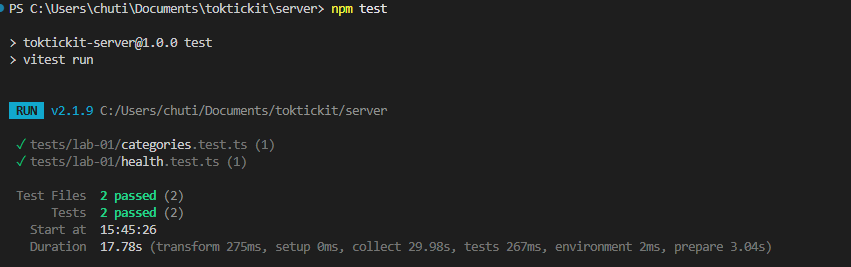
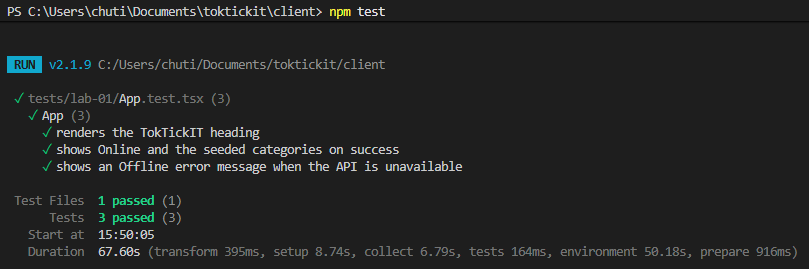

# Lab 1 — Test Plan and Evidence

All test files live under `server/tests/lab-01/` and `client/tests/lab-01/`.

| # | ID | Tool | Test | Result |
|---|-----|------|------|--------|
| 1 | API-01 | Supertest | `GET /api/health` returns 200, `status = ok`, `service = TokTickIT API` | Passed |
| 2 | API-02 | Supertest | `GET /api/categories` returns the 4 seeded categories in id order | Passed |
| 3 | UI-01 | Vitest | "TokTickIT" heading renders | Passed |
| 4 | UI-02 | Vitest | Success state shows Online + the fetched category list | Passed |
| 5 | UI-03 | Vitest | Error state shows Offline + a useful error message | Passed |

## Terminal output / screenshots

### `server` — `npm test`

```

```

### `client` — `npm test`

```

```